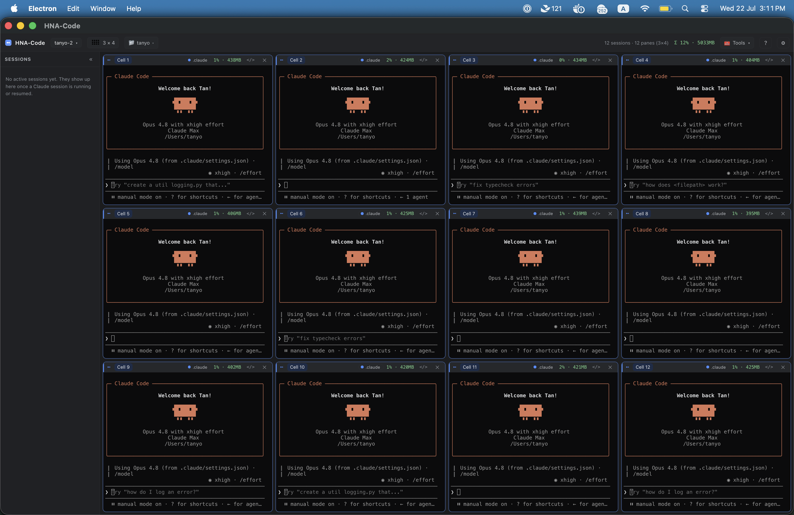
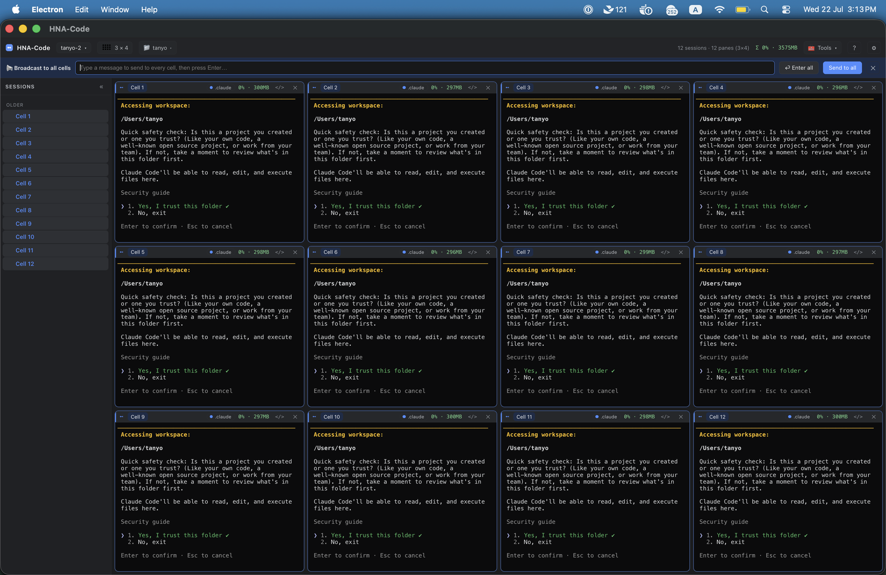
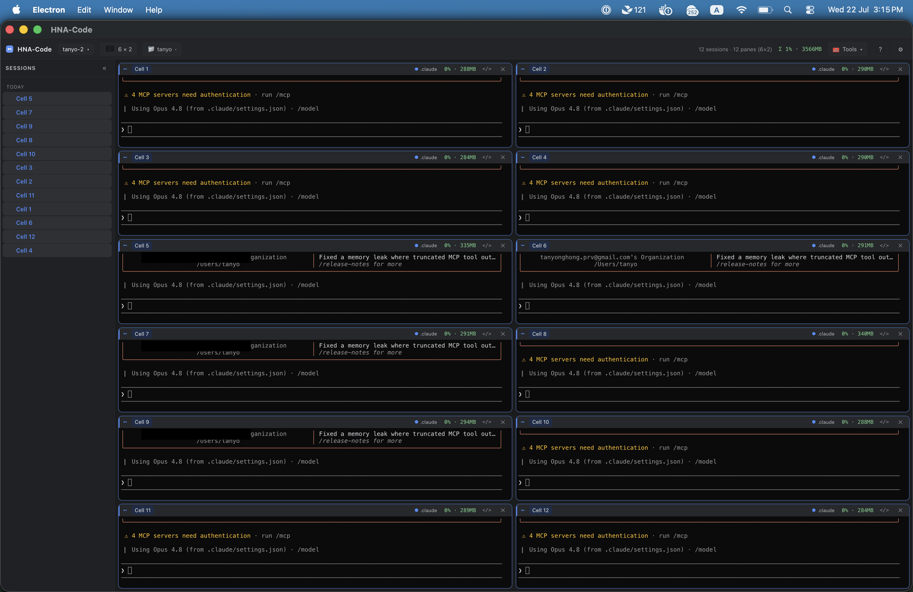
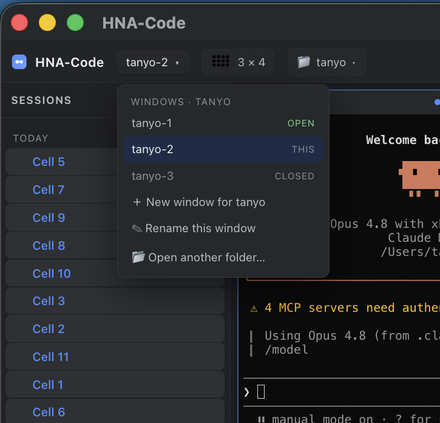
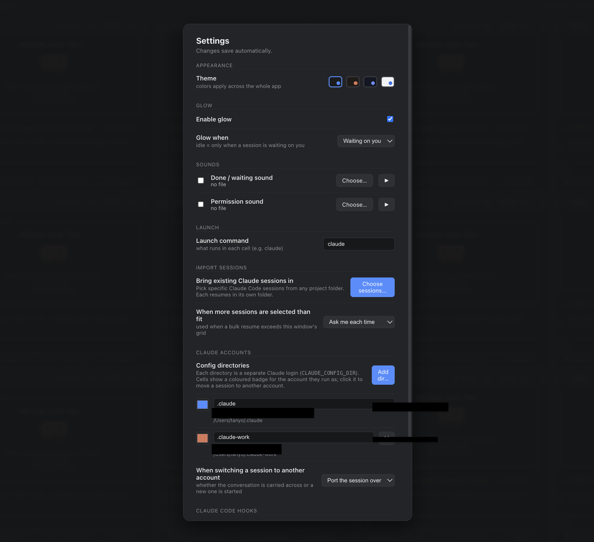
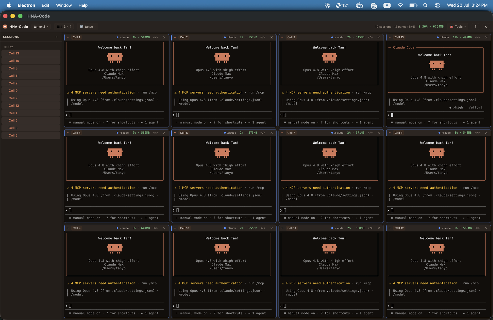

<h1 align="center">HNA-Code — mission control for coding agents</h1>

<p align="center"><b>Humans and Agents Code.</b> Run many <a href="https://claude.ai/code">Claude Code</a> sessions at once in a live grid — each cell glows the moment its agent needs you, across multiple accounts, and the whole board resumes after a restart.</p>

> 🔥 **v0.3.0 — Multiple Claude accounts.** Run several Claude logins side by side, see which account each cell is burning, and move a live session between accounts with one click. [Download](https://github.com/tyhh00/HNA-Code/releases/tag/v0.3.0) · [Release notes](https://github.com/tyhh00/HNA-Code/releases/tag/v0.3.0)
>
> 🧭 **Built for Claude Code today, designed for more.** The vision is to make agentic coding — Claude Code, Codex, any harness — dramatically more productive by giving you one place to command a whole fleet of agents. Claude Code is the first fully supported harness.

<p align="center">
  
</p>

<p align="center">
  <a href="https://github.com/tyhh00/HNA-Code/releases"></a>
  <a href="LICENSE"></a>
  
  
</p>

## What is HNA-Code

When you run more than one or two coding agents, the terminal stops scaling. You lose track of which session is waiting on you, which is mid-task, and which folder each one belongs to — and closing the window loses the lot.

HNA-Code is a desktop app that turns that chaos into a **board**. Every cell is a real terminal running `claude`, laid out in a grid you choose. A cell **glows** the instant its agent finishes a turn or needs a permission — so you tend the ones that need you and let the rest work.

**The board is stateful.** Close the window — or restart your whole machine — and reopening loads every session back, in the same order, each resumed exactly where it left off in its own folder, with its name and glow intact. You move fast with a dozen agents and never lose your place; a reboot costs you nothing.

And because heavy users run more than one Claude subscription, HNA-Code makes accounts first-class: it auto-detects your Claude config directories (your work sub, your personal sub — add more anytime), shows which one each cell is running as, and lets you **port a live session to another subscription** with one click — so when one account hits its usage limit mid-task, you carry the whole conversation over and keep going.

## Tour

**Glow when a session needs you.** In the board above, a cell glows **amber** the moment its agent finishes and is waiting on you, and jumps to the top of the **needs-you** sidebar. Breathing **blue** means it's blocked on a permission. Type into a cell and its glow clears.

### Command every agent at once

<p align="center">
  
</p>

Broadcast types once and sends to every cell (`Ctrl+Shift+B`). Kick off the same task in every agent, or clear a prompt like Claude's "trust this folder?" across the whole board at once — no clicking through twelve windows.

### Lay it out for any screen

<p align="center">
  
</p>

Landscape layouts (2×4, 3×4, 4×4) for a normal monitor, portrait layouts (6×2, 8×2, 4×2, 6×1) for a vertical one. Shrinking the grid never kills a session — orphaned ones fold into tabs.

### Stateful windows — restart-proof

<p align="center">
  
</p>

Every window is stateful and scoped to its folder. Close one — or restart your machine — and reopening loads all its sessions back, in the same order, each resumed where it left off. Track and reopen windows per folder from the dropdown. You move fast with a dozen agents and never lose your place.

### Many accounts, one board — and Settings

<p align="center">
  
</p>

HNA-Code **auto-detects your Claude subscriptions** — a work login, a personal one — and you add more here. Each cell badges the account it runs as; click the badge to **port a live session to another subscription** when one hits its usage limit, and keep going where you left off. Settings is also where you enable **glow**, attach a **sound** to "done" / "needs permission" (so you hear which board to return to), pick a **theme**, and turn on the **performance view** to spot heavy sessions.

### Themes

<p align="center">
  
</p>

Recolour the whole app — graphite, Claude, midnight, or light — and flip on per-cell CPU / RAM to see which sessions are working hardest.

## Why HNA-Code

Agentic coding is fast, but a single agent leaves you waiting on it. The obvious move is to run several at once — and that's exactly where the plain terminal falls apart:

- **You miss the hand-off.** An agent finishes, or blocks on a permission, and sits idle because you were looking at another tab. HNA-Code glows it and surfaces it in the sidebar.
- **You lose your place.** A crash or a restart wipes a dozen conversations. HNA-Code resumes the whole board — real `claude --resume`, in each session's own folder.
- **You run out of usage.** One account hits its limit mid-task. HNA-Code lets you move that session to another account with a click and keep going.

It's not a headless orchestrator that runs agents *for* you — it's the command surface that keeps *you* in the loop over many agents at once.

## Quick start

### Download

Grab a build from the [Releases](https://github.com/tyhh00/HNA-Code/releases) page — macOS `.dmg`, Windows `.exe`, Linux `.AppImage`. Builds are **unsigned** (this is a free, open-source project), so the OS warns on first launch:

- **macOS:** right-click the app → **Open** (once), or run `xattr -dr com.apple.quarantine /Applications/HNA-Code.app`.
- **Windows:** SmartScreen → **More info** → **Run anyway**.

You'll also need [Claude Code](https://claude.ai/code) installed and on your `PATH` (`claude`).

### Run from source

```bash
npm install
npm start
```

Glow and resume work out of the box — the app installs its Claude Code hooks on startup and learns each session id as it starts.

## Features

- **Stateful windows.** Close a window or restart your machine — reopening restores every session, in the same order, each resumed with `claude --resume` in its own folder, with its name and glow. Your progress is never lost.
- **Grid of live terminals.** One real PTY per cell running `claude`. Landscape layouts (2×4, 3×4, 4×4) for normal screens and portrait layouts (6×2, 8×2, 4×2, 6×1) for a vertical monitor. Shrinking the grid folds orphaned sessions into tabs instead of killing them.
- **Glow when a session needs you.** Amber when a turn ends, breathing blue when a permission is pending; typing clears it.
- **Sounds so you know where to return.** Attach your own sound to "done" and "needs permission" — when a board across the room finishes, you hear which one to go back to.
- **Broadcast to every agent at once.** Type once, send to every cell (`Ctrl+Shift+B`) — kick off the same task everywhere, or answer a prompt like "trust this folder?" across the whole board in one keystroke.
- **Multiple Claude subscriptions.** Auto-detects your `CLAUDE_CONFIG_DIR` profiles (work + personal), badges each cell with the account it runs as, and ports a live session to another subscription on click — your escape hatch when one hits its usage limit. Add or hide directories and set per-account colours in Settings.
- **Zero-friction setup.** Launch on a folder that already has Claude sessions and HNA-Code offers to import them — all, a selection, or only ones after a date — opening them one at a time with an overflow prompt when they don't all fit.
- **Needs-you-first sidebar.** A live list of your real sessions, whatever needs you pinned on top, click to jump.
- **Performance view.** Toggle per-cell and per-window CPU / RAM to see which sessions are heavy.
- **Themes, editable names, recent folders, open-in-VS-Code.**
- **Your config stays yours.** Glow hooks are added to each account's `settings.json`; only HNA-Code's entries are touched, and you can disconnect.

## How it works

```
 Electron main                                   each cell
 - one PTY per cell (runs claude)                <shell> -> claude --resume <id>
 - 127.0.0.1 signal server (+ per-run token)             |
 - per-window state (layout, names, glow,                | hook POSTs {cell, session_id, kind}
   sessions, account binding)                            v
 Renderer                                        signal.sh / signal.ps1
 - xterm.js grid, glow, sidebar, settings        (SessionStart / Stop / idle / permission)
```

- Each cell spawns with `CC_CELL_ID`, the signal server's port + token, and — for a profile-bound cell — its account's `CLAUDE_CONFIG_DIR`.
- A small hook (`src/hooks/signal.sh`, or `signal.ps1` on Windows) posts `{cell, session_id, kind}` back to the app on SessionStart, Stop, idle, and permission. That's how the app learns each cell's session id race-free and knows when to glow.
- State is written atomically and debounced, so a crash leaves the last good board.

See [`docs/ARCHITECTURE.md`](docs/ARCHITECTURE.md) for the full design.

## Compatibility

- **Cross-platform:** macOS, Windows, Linux. The PTY ships prebuilt for all three (no compiler needed).
- **Claude Code hooks tested against `2.1.x`.** Glow and resume rely on the hook schema (SessionStart, the Notification matchers `idle_prompt` / `permission_prompt`, Stop, and `claude --resume`). If a future release changes them, glow degrades gracefully rather than breaking. PRs that widen the tested range are very welcome.

## Tests

```bash
npm test
```

Every feature is verified by driving the real app with Playwright (screenshots plus terminal-buffer assertions).

| Test | Covers |
|------|--------|
| `test/hooks.cjs` | settings.json merge preserves your own hooks; idempotent; clean uninstall |
| `test/smoke.mjs` · `test/grid.mjs` | live terminals, real PTY round trip, layout switching |
| `test/signal.mjs` · `test/glow.mjs` | hook round trip, cell correlation; done→amber, permission→blue, keystroke clears |
| `test/persist.mjs` · `test/settings.mjs` | autosave/resume of names, glow, sessions, cwd; settings survive restart |
| `test/multiwindow.mjs` · `test/tabs.mjs` · `test/workspaces.mjs` | multi-window, tab stacking, per-folder windows |
| `test/sidebar.mjs` · `test/home.mjs` | needs-you-first sidebar; first-run home page and recents |
| `test/import.mjs` · `test/import-manual.mjs` | one-click import and the cross-folder Settings importer |
| `test/accounts.mjs` | multi-account: discovery, switch, source-of-truth/dedupe, empty-cell handling |
| `test/overflow.mjs` | staggered bulk resume and the overflow prompt |

## Building and releasing

```bash
npm run pack:mac      # macOS: dist/HNA-Code-<version>.dmg + .zip (run on a Mac)
npm run pack:portable # Windows: single-file portable .exe
npm run pack:linux    # Linux: .AppImage
```

Each OS builds only its own installers, so cross-building happens in CI: pushing a `vX.Y.Z` tag runs [`.github/workflows/release.yml`](.github/workflows/release.yml), which builds unsigned artifacts on macOS, Windows and Linux runners and attaches them to the GitHub Release — free, no store fees. Code-signing (to remove the first-launch OS warning) is optional electron-builder config, not required for a personal or OSS build.

## Contributing

Issues and pull requests welcome. Good first areas: widening the tested Claude Code version range, more layouts, packaging, and support for additional agent harnesses.

## License

[MIT](LICENSE)
